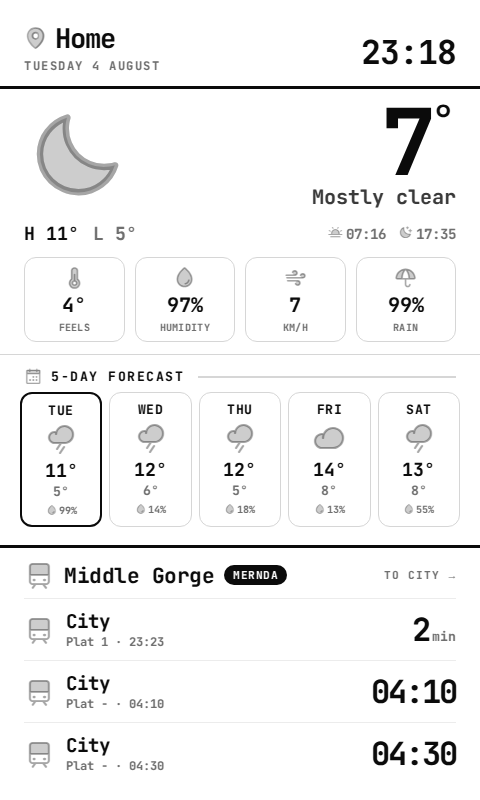
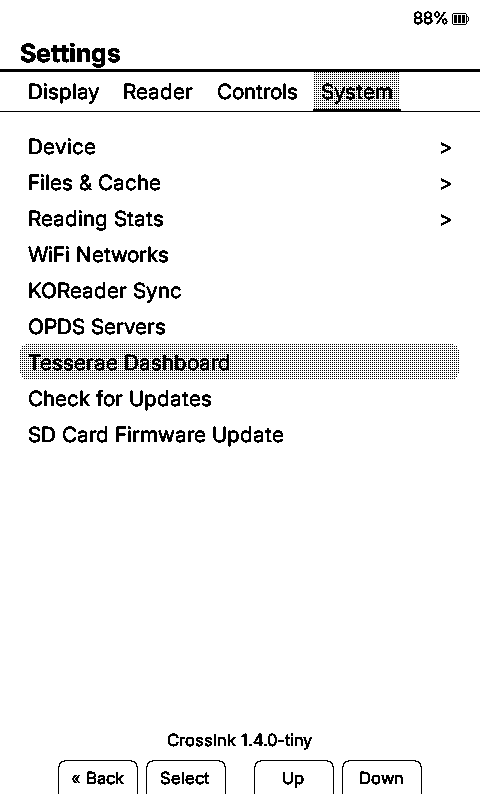
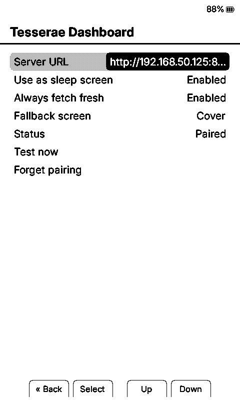

# CrossInk + Tesserae

Paint a server-rendered [Tesserae](https://github.com/dmellok/tesserae) dashboard as your Xteink e-reader's sleep screen.

<p align="center">
  
</p>

A fork of [uxjulia/CrossInk](https://github.com/uxjulia/CrossInk) that adds a Tesserae client. Everything sits behind `-DCROSSINK_TESSERAE`, so it compiles out completely and the reader is unchanged without it.

## Why it works this way

Most e-paper dashboards are wake-cycle devices: deep sleep, wake on a timer, fetch, paint, sleep. That is fine for a dedicated panel with its own battery. This is a reader, and the cell is shared with actual reading, so a polling loop would wreck it.

Instead the dashboard hangs off the sleep screen. **The radio comes up only on an explicit sleep transition, never on a timer.** You press power or it times out, it fetches a frame, paints it, and drops the radio. The refresh rate is exactly how often you put the reader down.

The upside beyond battery: it inherits the firmware's existing panel-controller detection and ghosting handling instead of reimplementing them. The trade-off: the dashboard is only as current as the last time you closed the reader.

**Every failure falls back.** No WiFi, server down, unapproved pairing, wrong frame size, torn cache: you get whichever sleep screen you picked. A dashboard problem never leaves a blank or half-drawn panel.

## Supported hardware

| Device | Panel | Status |
|---|---|---|
| Xteink X4 | 800×480 | Working, confirmed on hardware in mono and 4-level grayscale |
| Xteink X3 | 792×528 | Working, confirmed on hardware in 4-level grayscale |
| Xteink X4 Pro | 800×480 | Untested. Same panel and controller as the X4 |

One binary drives X3 and X4; the panel is detected at boot and the reader registers itself as the matching Tesserae device automatically.

## Quick start

You need a Tesserae server on your network and a WiFi network already saved on the reader.

### 1. Build and flash

```sh
git clone --recursive -b tesserae-client https://github.com/dmellok/CrossInk
cd CrossInk
pio run -e tiny -t upload
```

`-e tiny` is the shippable X3/X4 build. Use `-e default` for a compile check.

Grayscale is on by default. For the mono path, which is half the download and a single panel pass, drop `-DCROSSINK_TESSERAE_GRAYSCALE` from `platformio.ini`.

### 2. Pair with Tesserae

1. Save a WiFi network under **Settings → System → WiFi Networks**. The sleep path only uses stored credentials, so this has to happen first
2. **Settings → System → Tesserae Dashboard** → set **Server URL**, e.g. `http://192.168.1.50:8765`
3. Turn **Use as sleep screen** on
4. Press **Test now**. Expect *"Approve in Tesserae"* the first time
5. In Tesserae: **Settings → Devices**, find the reader in the Discovered strip, click **Register**
6. **Test now** again. It fetches a real frame and previews it full-screen; any button dismisses it

Pairing is zero-touch and covers MAC auto-claim, so reflashing silently re-acquires the same pairing.

### 3. Turn it on

**Settings → Display → Sleep Screen → Tesserae**.

## Settings

**Settings → System → Tesserae Dashboard**

<table>
  <tr>
    <td align="center" width="50%">
      <br/>
      <em>Settings &rarr; System</em>
    </td>
    <td align="center" width="50%">
      <br/>
      <em>Tesserae Dashboard</em>
    </td>
  </tr>
</table>

| Setting | What it does |
|---|---|
| Server URL | Tesserae base URL. Changing it drops the pairing, since the token belongs to the server that issued it |
| Use as sleep screen | Master enable |
| Always fetch fresh | Ask the server to re-render on every sleep rather than sending a conditional request. Off by default: it costs a full download each time instead of a 304 |
| Fallback screen | What to paint when the dashboard can't be fetched |
| Status | Not Set / Not paired / Approve in Tesserae / Paired |
| Test now | Fetch and preview a real frame without waiting for a sleep |
| Forget pairing | Only shown when paired |

**View dashboard** opens it full-screen while the reader is awake instead of waiting for a sleep. The cached frame paints instantly with no radio, Select refreshes, Back exits.

Two power-button shortcuts live under **Settings → Controls**: *View dashboard* and *Refresh Dashboard* (which discards the cache and sleeps, so the next fetch is a fresh render). Map either to the short press, whose default is `Ignore`, rather than the long press, which defaults to `Sleep`.

## How the frame gets there

The server does all the rendering. Tesserae composes the dashboard, dithers it, and packs it into the panel's native buffer. The firmware decodes nothing, because the packing is already exactly how `GfxRenderer` reads bitmaps: mono is a copy into the framebuffer, grayscale is a base frame plus two bit-planes.

Frames are cached on the SD card, so an unchanged dashboard repaints without re-downloading.

Full detail, including the wire formats and the refresh semantics, is in **[docs/tesserae.md](./docs/tesserae.md)**.

## Known limitations

- **The dashboard is as fresh as the last time you closed the reader.** No timer wake. On this hardware that is not just a design choice: the battery latch cuts power to the MCU during sleep, RTC included, so there is nothing left running to fire a timer
- No touch. Tesserae's protocol supports it, the X4 has no digitiser
- Only zero-touch pairing is built; the 6-digit pairing-code path is not
- Battery impact over weeks of real use is unmeasured

## Not going upstream

CrossInk's [`SCOPE.md`](./SCOPE.md) lists *Active Connectivity* as out of scope, which is a fair call for a reading device. This is kept as a thin patch series on top of `main` rather than proposed for merge. Upstream owns the display abstraction and sleep-screen plumbing this is built on; all this branch does is hang a network fetch off the end of them.

---

> **This is a personal fork of [CrossPoint Reader](https://github.com/crosspoint-reader/crosspoint-reader)** with a focus on improved fonts and minimal reading stats.

## What's different in this fork

My goal with this fork was to maintain the core Crosspoint firmware while integrating my preferred typography and some lightweight reading statistics. I’ve focused on keeping the underlying system stable while layering in a few "nice-to-have" features and UI refinements along the way.

<table>
  <tr>
    <td align="center">
      <br/>
      <em>Font: Bitter, Size: 12 pt, Margin: 15</em>
    </td>
    <td align="center">
      <br/>
      <em>Reading Stats with custom front button mapping shown</em>
    </td>
  </tr>
</table>

---

**Note**: This firmware is confirmed to be working on both the X3 and X4.

### Highlights

- New reader fonts: Lexend Deca and Bitter.
- Unicode emoji and miscellaneous symbols support (a limited subset).
- Adjusted font sizes: 8 pt, 9 pt, 10 pt, 12 pt, 14 pt, 16 pt, 18 pt, and 20 pt. See [Font Build Variants](./docs/font-build-variants.md) for more details.
- Added ~~strikethrough~~ support.
- Made <u>underlines</u> thicker for better visibility.
- Added a custom `Minimal` theme and sleep screen option for the minimalists out there.
- Added a custom `Dashboard` theme and sleep screen option for reading stats enthusiasts.
- Added support for `<hr>` section breaks.
- Added support for "redaction" style rendering.
- Added improved support for tables with simple markup.
- Added ability to add bookmarks.
- Added ability to remap front buttons that only applies in the reader.
- Added Bionic Reading and Guide Dots as optional reader modes.
- Added Force Paragraph Indents for books that render as one giant wall of text.
- Added ability to pin a sleep image as a favorite. The favorited image will always be displayed when your sleep settings are set to `Custom` or `Cover + Custom` (when no cover is available).
- Added more in-reader control remapping options for side buttons, short power button clicks, and long-press menu actions.
- Added ability to mark a book as finished from the in-book menu. A pop-up will also display once 99% of the book is reached. This status allows tracking of total books read.
- Added ability to move finished books to "Read" folder.
- In-book menu to quickly adjust reader options without having to exit the book.
- Reading stats: total books read, total reading time, number of sessions, pages turned, average session time, pages turned per minute. You can also set your reading stats as your sleep screen.
- All-time reading stats [syncing](./docs/reading-stats-sync.md) between two CrossInk devices.
- Reading [progress sync](./docs/nearby-position-sync.md) between two CrossInk devices.
- Added customizable Auto Page Turn Interval (anything between 5-120 seconds).
- Added ability to view Recent Books as a 3x3 grid view.
- To view a more detailed list for each version, visit the [releases](https://github.com/uxjulia/CrossInk/releases) page to read release notes.

---

### Reader Fonts

The default fonts have been replaced with Lexend Deca and Bitter. These fonts have been chosen specifically to improve reading fluency and e-ink performance. These 'sturdier' typefaces feature uniform stroke weights and open geometries, allowing the X4/X3 to render crisp, high-contrast text with font-aliasing on while significantly reducing ghosting and artifacts.

- [Lexend Deca](https://fonts.google.com/specimen/Lexend+Deca) - A research-backed sans-serif typeface designed to improve reading fluency. Lexend was engineered based on the theory that reading issues are often a design problem (visual crowding) rather than a cognitive one.
- [Bitter](https://fonts.google.com/specimen/Bitter) - A "contemporary" slab serif typeface for text, it is specially designed for comfortably reading on digital screens. The consistent stroke weight of Bitter helps it render particularly well on e-ink devices. The medium weight has been chosen specifically for improved rendering on the X4/X3.

The UI now uses [Inter](https://fonts.google.com/specimen/Inter) as the display font which has improved readability at smaller sizes.

### Emojis and Misc Glyphs

- Support for a limited set of Unicode [Emoticons](https://unicode-explorer.com/b/1F600) and [Miscellaneous Symbols](https://unicode-explorer.com/b/2600) using [Noto Emoji](https://fonts.google.com/noto/specimen/Noto+Emoji) and [Noto Sans Symbols](https://fonts.google.com/noto/specimen/Noto+Sans+Symbols) font.

---

### Font Sizes

There are 2 available build variants to choose from due to build size constraints: `tiny`, and `xlarge`.

See [Font Build Variants](./docs/font-build-variants.md) for the full point-size and emoji-support matrix.

---

### Reader features

Reader Options, Bionic Reading, Guide Dots, Force Paragraph Indents, reading stats, and finished-book behavior are documented in [Reader Features](./docs/reader-features.md).

### Custom button actions

CrossInk adds configurable button shortcuts.

See [Controls](./docs/controls.md) for the full action list and defaults.

---

## Tips for the best reading experience

CrossInk runs on an ESP32-C3 with limited RAM, so very large folders or complex EPUBs can be slower than they would be on a phone, tablet, or desktop app.

- Keep folders under about 200 files. For the smoothest browsing, aim for 50-100 files per folder.
- Having 1000+ books on the SD card is fine if they are split into smaller folders, such as by author, series, genre, or read/unread status.
- Avoid putting every book in the SD card root. The file browser has to scan and sort the current folder before it can show it.
- Text-first EPUBs are the best fit. Large image-heavy EPUBs, scanned books, comics, and omnibus files with thousands of sections may load slowly or fail under memory pressure.
- As a rough target, EPUBs under 20 MB tend to work the best. Files over 50 MB may still work, but they are more likely to be slow or memory-sensitive, especially if they contain many large images.
- If an EPUB is unusually slow, try [optimizing](./docs/webserver.md#epub-optimization) it with the built-in web optimizer (via File Transfer) before copying it to the SD card: remove unused high-resolution images, split very large omnibus files, and avoid embedding multiple full font families when possible.
- Use a reliable SD card and leave some free space. CrossInk stores settings, reading progress, cache files, stats, and generated book data on the card.

## Development Device Simulator

The [device simulator](https://github.com/uxjulia/crosspoint-simulator) renders the e-ink display in an SDL2 window so firmware changes can be sanity-checked without flashing hardware.

See [Simulator](./docs/simulator.md) for setup, platform notes, keyboard controls, and cache tips.

---

## Installation

Download a `firmware-*.bin` from the [releases page](https://github.com/uxjulia/CrossInk/releases), then flash it with the web installer or command line.

See [Installation](./docs/installation.md) for step-by-step flashing and revert instructions.

---

## Documentation

- [User Guide](./USER_GUIDE.md)
- [Installation](./docs/installation.md)
- [Font Build Variants](./docs/font-build-variants.md)
- [Reader Features](./docs/reader-features.md)
- [Controls](./docs/controls.md)
- [Simulator](./docs/simulator.md)
- [Data Cache](./docs/data-cache.md)
- [Web server usage](./docs/webserver.md)
- [Web server endpoints](./docs/webserver-endpoints.md)
- [Common issues](./docs/troubleshooting.md)
- [Project scope](./SCOPE.md)
- [Contributing docs](./docs/contributing/README.md)

---

## Development quick start

CrossInk uses PlatformIO for building and flashing firmware.

See [Getting Started](./docs/contributing/getting-started.md) for prerequisites, clone setup, hooks, and validation commands.

### Build / flash / monitor

Connect your Xteink X4 or X3 via USB-C and run:

```sh
pio run -e tiny --target upload
```

Replace `tiny` with another build variant if needed. See [Font Build Variants](./docs/font-build-variants.md).

See [Testing and Debugging](./docs/contributing/testing-debugging.md) for serial logging, simulator checks, static analysis, and bug-report guidance.

---

## Internals

The ESP32-C3 has about 380 KB of usable RAM, so CrossInk stores reusable book and device data on the SD card instead of rebuilding everything in memory.

See [Data Cache](./docs/data-cache.md) for the `.crosspoint` layout and [File Formats](./docs/file-formats.md) for binary cache details.
